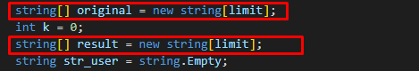
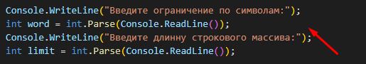
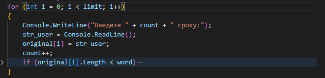
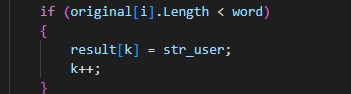
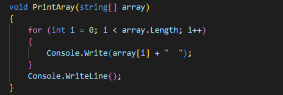
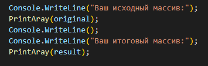

# Итоговое задание! 

## Задача 

Написать программу, которая из имеющегося массива строк формирует массив из строк, длина которых меньше либо равна 3 символа. Первоначальный массив можно ввести с клавиатуры, либо задать на старте выполнения алгоритма. При решении не рекомендуется пользоваться коллекциями, лучше обойтись исключительно массивами.

## Примеры

["Ье11о", "2", "\уогШ", -> ["2",
["1234", "1567", "-2", "сошрЩег змепсе"] -> ["-2"] ["Киззга", "Бешпагк", "Кагал"] -> []

## Алгоритм Решения
1. Для начала определим 2 массива исходный и итоговый

2. Дадим пользователю возможностьсамому определить длинну нашего массива и лимит символов строк итогового массива

3. Описываем цикл введения пользователем строк в исходный массив

4. Создаём условие для заполнения итогового массива исходя из введённого пользователем ограничения на количесто символов

5. Добавляем метод печати массива

6. И, наконец, выводим наши оба массива в консоль

# ***Всем успехов в обучении!*** 
